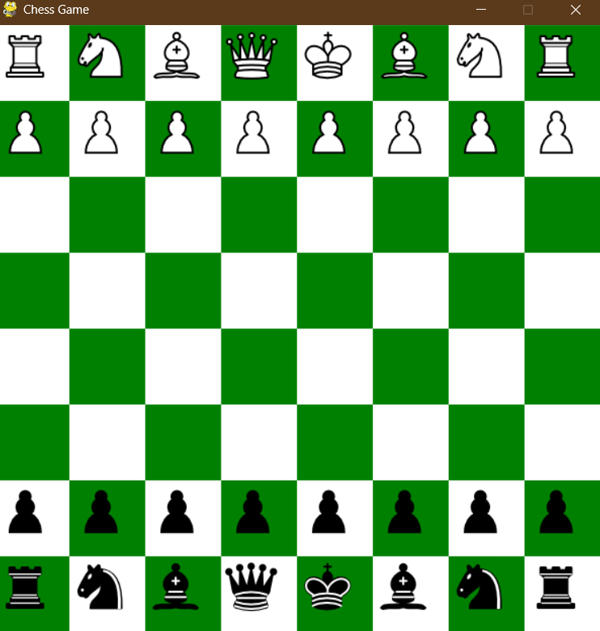

# Chess Game with AI and Pygame

 <!-- Add a screenshot of your game here -->

A fully-featured chess game built using Python, Pygame, and the Stockfish chess engine. This project includes a graphical interface, sound effects, move highlighting, and an AI opponent. It supports all standard chess rules, including special moves like castling, pawn promotion, and en passant.

## Features

- **Graphical Interface**: Built using Pygame for a smooth and interactive experience.
- **AI Opponent**: Powered by Stockfish, one of the strongest chess engines in the world.
- **Sound Effects**: Realistic sounds for moves, captures, and checkmate.
- **Move Highlighting**: Visual feedback for legal moves when a piece is selected.
- **Timer**: Each player starts with 10 minutes, and the timer decreases during their turn.
- **Game Over Screen**: Displays checkmate, stalemate, or draw conditions.
- **Special Moves**: Supports castling, pawn promotion, and en passant.

## How to Play

1. **White** (human) moves first by clicking on a piece and then clicking on the destination square.
2. **Black** (AI) will automatically make its move after White.
3. The game ends when checkmate, stalemate, or a draw condition is reached.

## Installation

### Prerequisites

- Python 3.x
- Pygame
- Stockfish chess engine

### Steps

1. Clone the repository:
   ```bash
   git clone https://github.com/your-username/chess-game.git
   cd chess-game
   ```

2. Install the required Python libraries:
   ```bash
   pip install pygame python-chess
   ```

3. Download Stockfish:
   - Visit the [Stockfish website](https://stockfishchess.org/download/) and download the appropriate version for your operating system.
   - Place the Stockfish executable in the project folder.

4. Add the `pieces` folder:
   - Download or create images for each chess piece (e.g., `White_Pawn.png`, `Black_King.png`, etc.).
   - Place these images in a folder named `pieces`.

5. Add the `sounds` folder:
   - Download or create sound effects for moves, captures, and checkmate.
   - Place these sounds in a folder named `sounds`.

6. Run the game:
   ```bash
   python chess_game.py
   ```

## Folder Structure

```
chess-game/
│
├── chess_game.py          # Main script
├── stockfish              # Stockfish executable (macOS/Linux)
├── stockfish.exe          # Stockfish executable (Windows)
│
├── pieces/                # Folder containing piece images
│   ├── White_Pawn.png
│   ├── White_Rook.png
│   ├── White_Knight.png
│   ├── White_Bishop.png
│   ├── White_Queen.png
│   ├── White_King.png
│   ├── Black_Pawn.png
│   ├── Black_Rook.png
│   ├── Black_Knight.png
│   ├── Black_Bishop.png
│   ├── Black_Queen.png
│   └── Black_King.png
│
├── sounds/                # Folder containing sound effects
│   ├── move.wav
│   ├── capture.wav
│   └── checkmate.wav
│
├── README.md              # Project documentation
└── screenshot.png         # Screenshot of the game
```

## Customization

- **AI Difficulty**: Adjust the AI difficulty by changing the `time` parameter in `engine.play` (located in the `main` function).
- **Timer**: Modify the `WHITE_TIME` and `BLACK_TIME` variables to change the initial timer values.
- **Sound Effects**: Replace the `.wav` files in the `sounds` folder with your own sounds.

## Contributing

Contributions are welcome! If you'd like to improve this project, please follow these steps:

1. Fork the repository.
2. Create a new branch for your feature or bugfix.
3. Commit your changes.
4. Submit a pull request.

## License

This project is licensed under the MIT License. See the [LICENSE](LICENSE) file for details.

---

## Screenshots

 

---

## Acknowledgments

- [Pygame](https://www.pygame.org/) for the graphical interface.
- [Python-Chess](https://python-chess.readthedocs.io/) for chess logic.
- [Stockfish](https://stockfishchess.org/) for the AI opponent.

---

Enjoy playing chess! If you have any questions or feedback, feel free to open an issue or contact me.

---
